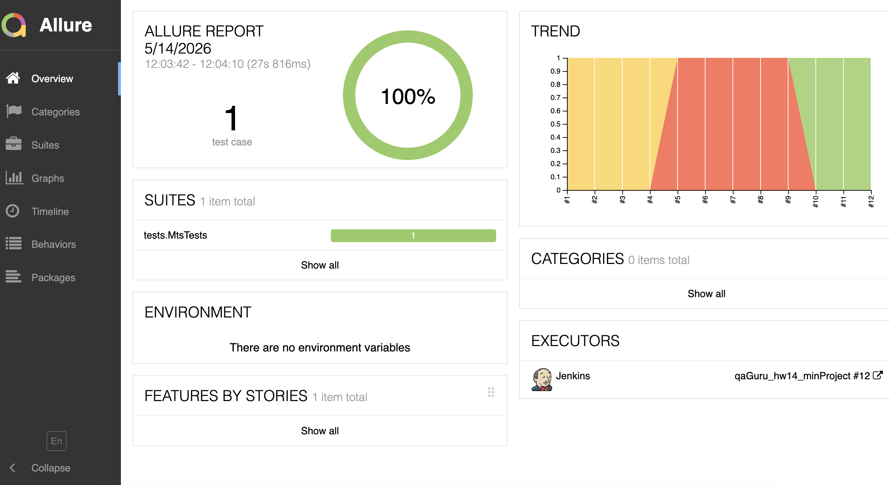
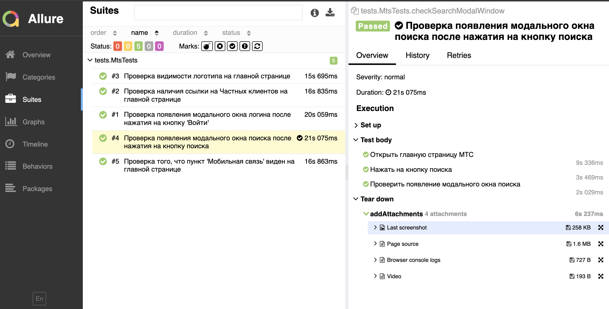
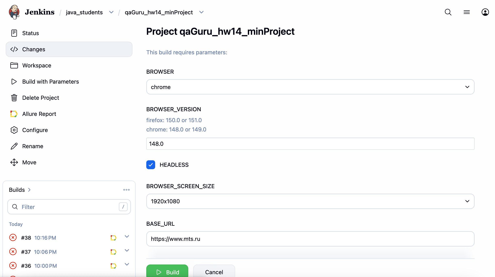
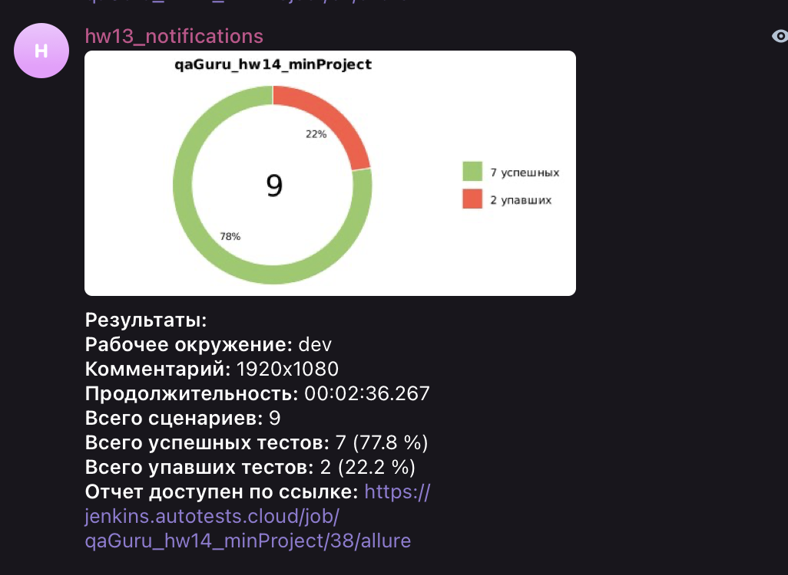

# Автоматизация тестирования портала MTS.ru (UI)


Данный проект представляет собой профессиональный фреймворк для автотестирования главной страницы сайта [MTS](https://www.mts.ru). В нем реализован полный цикл CI/CD: от написания кода на Java до получения уведомлений в Telegram.

---

### 💻 Технологический стек
* **[Java 17+](https://www.java.com/)** — основной язык разработки.
* **[Selenide (7.14.0)](https://selenide.org/)** — лаконичный фреймворк для UI-тестов.
* **[JUnit 5 (5.10.0)](https://junit.org/junit5/)** — современный движок для запуска тестов.
* **[Gradle 8.х](https://gradle.org/)** — мощная система сборки.
* **[Allure Report](https://allurereport.org/)** — интерактивные отчеты о прохождении тестов.
* **[Selenoid & Docker](https://selenoid.autotests.cloud/)** — запуск браузеров в изолированных контейнерах.
* **[Jenkins](https://www.jenkins.io/)** — автоматизация запусков (CI/CD).
* **[Telegram Bot](https://core.telegram.org/bots/api)** — мгновенные уведомления о результатах.

---

### 🏗 Архитектура проекта
Проект построен с использованием паттерна **Page Object Model (POM)**:
* **Разделение слоев**: Описания элементов и логика действий вынесены в класс `MtsPage`, что упрощает поддержку тестов.
* **Fluent Interface**: Тесты написаны в стиле цепочек вызовов (method chaining), что делает их читаемыми.
* **Стабильность (Anti-Flaky)**: В методы клика встроена автоматическая обработка всплывающих окон (локация), что предотвращает ошибку `ElementClickInterceptedException`.

---

### 🧪 Реализованные тесты
В рамках проекта автоматизированы следующие UI сценарии:

## Главная страница и навигация
* **Проверка видимости логотипа** на главной странице.
* **Проверка отображения элемента «Госзаказчикам»** на главной странице.
* **Проверка перехода в раздел «Госзаказчикам»** через верхнее меню с валидацией текущего URL (`/gos`).
* **Проверка наличия ссылки на «Частных клиентов»** на главной странице.

## Авторизация
* **Проверка появления модального окна логина** после нажатия на кнопку «Войти».

## Страница поиска
* **Проверка открытия страницы поиска** и доступности поля ввода.
* **Проверка блокировки кнопки «Найти»** (кнопка не активна) при пустом значении в поле ввода поиска.

---

### 📊 Отчетность и уведомления

#### [Allure Report](https://jenkins.autotests.cloud/view/java_students/job/qaGuru_hw14_minProject/19/allure/)
Детальные отчеты с аннотациями `@Step`, скриншотами и системными логами.
> **Скриншот Dashboard:**
> 
> > **Скриншот с отражением аннотаций и вложений:**
> 

#### [Jenkins Pipeline](https://jenkins.autotests.cloud/view/java_students/job/qaGuru_hw14_minProject/19/)
Тесты запускаются автоматически на удаленном сервере. Проект полностью интегрирован в CI/CD процесс.
> > **Скриншот страницы запуска сборки с возможностью настройки необходимых параметров:**
> 

#### Telegram Notifications
Результат каждого билда приходит в Telegram с указанием количества успешных/упавших тестов и ссылкой на отчет.
> **Пример уведомления:**
> 

---

### 🚀 Запуск проекта

**Локальный запуск:**
```bash
./gradlew clean test
